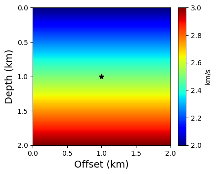
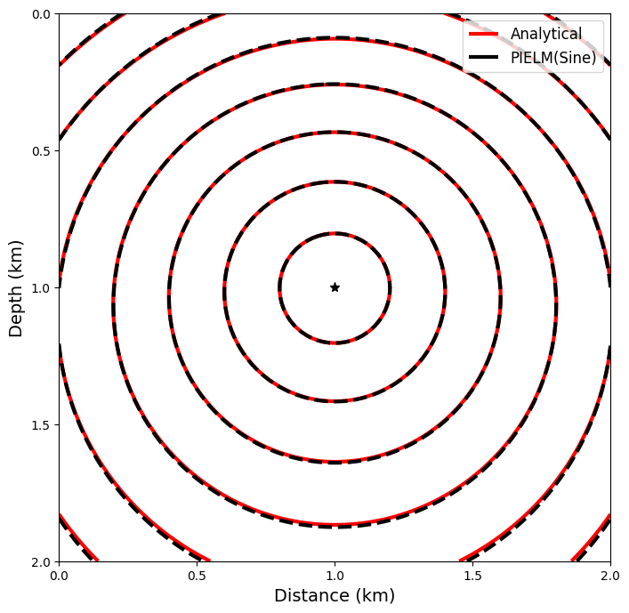

### Requirements
- Pytorch
- Numpy
- Matplotlib
- Jupyter notebook
 
*Ensure Python and PyTorch compatibility: Python 3.10.10 and PyTorch 2.7.1 are used here.*


### Quick tutorial

***

### Simplified validation run of PIELM Algorithm
##### Run in jupyter notebook
##### Import packages


```python
import torch
import torch.nn as nn
import torch.optim as optim
import numpy as np
import matplotlib.pyplot as plt
from torch.utils.data import DataLoader, TensorDataset

# Set random seeds for reproducibility
torch.manual_seed(42)
np.random.seed(42)
```

#### Define the (2x2km) geophysical domain, seismic source and visualize

<a href="https://github.com/RockEngineerSeun/PIELM-EikoNet/blob/711e52e5690d38612420463ad005645fb3492ccb/PIELM/PIELM%20README.md?plain=1#L35-L87">Domain</a>

    

    


#### Calculate the Analytical Solution 
- The analytical solution is calculated using the traveltime formula presented by [Morris Miller Slotnick](https://doi.org/10.1785/BSSA0500010162)


```python
# Analytical solution for reference traveltime field T0
def calculate_T0(x, z, xs, zs, v_ref):
    r = torch.sqrt((x - xs)**2 + (z - zs)**2)
    return r / v_ref

T0 = calculate_T0(X, Z, source_x, source_z, v_ref)

# Calculate analytical traveltime T_data
if vertgrad == 0 and horigrad == 0:
    T_data = torch.sqrt((X - source_x)**2 + (Z - source_z)**2) / v0
else:
    # Corrected analytical solution
    r_sq = (X - source_x)**2 + (Z - source_z)**2
    # Convert denominator to tensor
    denom = torch.sqrt(torch.tensor(vertgrad**2 + horigrad**2, device=device))
    term = 1.0 + 0.5 * (vertgrad**2 + horigrad**2) * r_sq / (v_ref * velmodel)
    # Clamp to avoid numerical issues
    term = torch.clamp(term, min=1.0 + 1e-8)
    T_data = torch.arccosh(term) / denom
```

#### Data preparation
- Collocation points are 25% of the gridpoints
- Compute autodifferentiation for traveltime within the 2D domain

https://github.com/RockEngineerSeun/PIELM-EikoNet/blob/c40267141ee65fa5a2e8b9466bfbad2f4f617851/PIELM/PIELM%20README.md?plain=1#L126-L176

#### Define 2D PIELM Algorithm and Train Model
- Uses a trainable slope parameter ***a*** that dynamically scales with the input frequency.
- Dual-ELM framework for both traveltime (u) and velocity (v); each has 2000 hidden units.

https://github.com/RockEngineerSeun/PIELM-EikoNet/blob/c40267141ee65fa5a2e8b9466bfbad2f4f617851/PIELM/PIELM%20README.md?plain=1#L183-L289

    Training time: 44.01 minutes
    

#### PIELM predicts traveltime for the seismic source


```python
# Predict on entire domain
with torch.no_grad():
    u_pred = elm_u(coords).reshape(nx, nz).cpu().numpy()
    v_pred = elm_v(coords).reshape(nx, nz).cpu().numpy()
    T_pred = T0.cpu().numpy() * u_pred
```


```python
# Analytical solutions for comparison
T0_np = T0.cpu().numpy()
T_data_np = T_data.cpu().numpy()
velmodel_np = velmodel.cpu().numpy()
```

#### Visualization

<a href="https://github.com/RockEngineerSeun/PIELM-EikoNet/blob/c40267141ee65fa5a2e8b9466bfbad2f4f617851/PIELM/PIELM%20README.md?plain=1#L316-L339">Result</a>



    


####  Please contact the corresponding author if you have any problem with the scripts.
